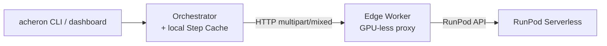

# Acheron

## What is Acheron

Acheron is a distributed asynchronous audio-transformation pipeline that converts EPUB or audio input into chapterized audiobooks in a target language.

## Prerequisites

**System:**

- Python 3.14+
- [uv](https://docs.astral.sh/uv/) (package manager)
- [just](https://just.systems/) (command runner)
- [direnv](https://direnv.net/) (optional, auto-activates the local venv via `.envrc`)
- Docker and Docker Compose

**CLI:**

- `acheron` (for submitting and monitoring jobs)
- `runpodctl` (operators only, for creating RunPod serverless endpoints)

## Quick Start

```bash
cp .env.example .env
docker compose up --build
```

The stack comes up with these default services:

- **Orchestrator** at `https://localhost:8000`. TLS is auto-enabled because the `certs-init` one-shot service generates a self-signed CA and per-service certs into `./certs/` on first run, and the compose file mounts them into every container.
- **Dashboard** at `http://localhost:8080`.
- **Redis** on `localhost:6379`.
- **Local stub workers** (TTS, ASR, translation, gRPC) auto-register with the orchestrator and return mock data. Replace with real GPU workers for production.

## Basic CLI Commands

```bash
# Submit an EPUB
acheron job submit book.epub --src en --dest es

# Submit an audio file (requires an ASR model)
acheron job submit podcast.mp3 --src en --dest es --asr whisper-v3

# Check job status
acheron job status job-xyz
acheron job status job-xyz --verbose

# Resume a job (reuses cached step outputs)
acheron job resume job-xyz
# Resume from scratch (discards the step cache)
acheron job resume job-xyz --force-fresh

# System overview
acheron status
acheron jobs --active
acheron jobs --completed

# Registered workers
acheron workers

# Supported language pairs
acheron capabilities --src en --dest es
```

## Dashboard

The dashboard is an HTMX-based web UI for live monitoring at `http://localhost:8080`. It polls the orchestrator for job status, worker health, and cost.

## Development

The `Justfile` defines the development workflow. Run `just` to list all targets.

- `just validate` — full pipeline: `lint-strict`, `lint-imports`, `type-check` (mypy), `type-check-pyright` (basedpyright), `test`.
- `just lint-strict` — auto-format and ruff check.
- `just lint-imports` — enforce import boundaries (no `core/` → `shell/`, no `worker_sdk/` → `shell/`, no `workers/` → `shell/`).
- `just type-check` — mypy on `src/`, `tests/`, and worker packages.
- `just type-check-pyright` — basedpyright (matches editor LSP).
- `just test` — pytest.
- `just proto` — regenerate protobuf code after editing `proto/synthesis.proto`.
- `just certs` — regenerate the dev TLS CA and per-service certs in `./certs/`. Not needed for `docker compose up`; the `certs-init` service does this automatically.
- `just build-worker <name>` — build a RunPod worker image locally for dev iteration. CI publishes images to `ghcr.io` on pushes to `main` and version tags.
- `just build-edge` — build the generic edge image (`acheron-worker-edge`).

## Architecture



(Step Cache lives inside the orchestrator's `ACHERON_DATA_DIR`; it is a sub-component of the orchestrator, not a separate downstream node. Render the diagram at [mermaid.live](https://mermaid.live/) if it does not load in your viewer.)

The orchestrator's local in-process CPU handlers (`EXTRACTION`, `CHUNKING`, `PACKAGING`) run on the orchestrator host; only GPU-bearing steps (TTS, ASR, translation) traverse the Edge Worker.

### Serverless GPU Workers

GPU inference runs in [RunPod Serverless](https://www.runpod.io/serverless-gpu) endpoints. Endpoints scale to `0` GPU instances when idle and cold-start on a job's arrival, so there is no always-on GPU cost. A worker image boots on demand, serves the job, then shuts down on the endpoint's idle timeout. Cold starts amortize across requests when the model weights are pre-loaded on a Network Volume; subsequent jobs in the same window skip the multi-GB download.

### Edge Workers (GPU-less Proxies)

The GPU containers inside RunPod Serverless are addressable only via RunPod's API — they do not expose `/health` or `/execute` directly and do not register back to Acheron. An **Edge Worker** is a lightweight, GPU-less container with HTTP(S) reachability to the orchestrator that:

1. Registers with the orchestrator at startup (`register_with_orchestrator` in `src/acheron/worker_sdk/registration.py`).
2. Serves `GET /health`, `GET /capabilities`, and `POST /execute` locally (mounted from the inner `EdgeApp` in `src/acheron/worker_sdk/app.py`).
3. Forwards `/execute` payloads to the configured RunPod endpoint via `RunPodForwarderHandler` and returns the result artifacts (`src/acheron/worker_sdk/cloud.py`).
4. Queries RunPod's GraphQL API on schedule (`RunPodPrice.refresh()`) to discover the endpoint's active GPU type and hourly rate (`src/acheron/worker_sdk/pricing.py`).

### Local In-Process Handlers (CPU)

The orchestrator runs in-process handlers for three orchestration steps that do not need a GPU. They are auto-registered at orchestrator startup (see `src/acheron/shell/orchestrator.py:152-170`); a user-registered worker of the same type takes precedence and shadows the built-in.

- **`EXTRACTION`** — EPUB chapter extraction or audio file copy (`ExtractionHandler` in `src/acheron/shell/local_handlers.py`).
- **`CHUNKING`** — text segmentation with a default `max_chunk_length` of **250 characters** per chunk (`ChunkingHandler`). Configurable under `workers.chunking.max_chunk_length` in `acheron.yaml`.
- **`PACKAGING`** — FFmpeg concat demuxer produces `.m4b` audiobooks with bitrate `128k` and codec `aac` by default (`PackagingHandler`). Configurable under `workers.packaging.{bitrate,codec}`.

### Local GPU Workers — Not Implemented

There is currently no path to run a GPU worker on the orchestrator host or on a separate GPU host you manage. All GPU inference goes through RunPod Serverless via an Edge Worker proxy; the handlers in `workers/qwen3tts/`, `workers/granite_speech/`, and `workers/translategemma/` only run inside the RunPod serverless runtime image.

### Worker SDK & Transports

The `worker_sdk` package is the framework every Layer 8 worker implements. Each handler is a `WorkerHandler` subclass with four methods (`src/acheron/worker_sdk/handler.py`):

- `capabilities()` — return the worker's static `WorkerCapabilities` (no I/O, sync).
- `handle(job, input=None)` — run inference for `job`, consuming an optional audio `Input`.
- `startup()` — async hook for model load / cache warmup; runs before any dispatch.
- `shutdown()` — async hook to release GPU memory at container teardown.

Three transports connect a worker to the orchestrator:

- **HTTP `multipart/mixed`** (default) — the orchestrator's `HttpWorker` POSTs an `ExecuteRequest` and parses a `multipart/mixed` body back, one binary part per `Artifact`. File-backed payloads (e.g., WAV on disk) stream in **64 KiB chunks** via `aiofiles` (`src/acheron/worker_sdk/artifacts.py:75`, `src/acheron/worker_sdk/inputs.py:76`); byte-backed artifacts (e.g., per-chapter WAVs) are sent as a single part. The orchestrator materializes received parts into its own `ACHERON_DATA_DIR` (`src/acheron/shell/transports/_multipart.py`), so workers and the orchestrator do not need a shared filesystem.
- **gRPC** — the `GrpcWorker` transport uses the same `Artifact` schema over a protobuf-defined `ExecuteRequest`/`ExecuteResponse` (`proto/synthesis.proto`).
- **Local** — direct in-process invocation, used by the built-in `EXTRACTION` / `CHUNKING` / `PACKAGING` handlers and the integration test suite.

Per-worker configuration is driven by a `worker.yaml` file, searched in this order (`src/acheron/worker_sdk/config_loader.py`):

1. `$WORKER_CONFIG` env var (explicit path).
2. `<cwd>/<worker_name>.worker.yaml`, where `worker_name` comes from `$WORKER_NAME` or the current directory's basename.
3. `<cwd>/worker.yaml`.

Env vars prefixed with `ACHERON_WORKER__` override YAML values at runtime, so the same image can be retargeted without rebuilding. **Three fields are env-only** — they are rejected when supplied via YAML or constructor and must come from `os.environ` (`src/acheron/worker_sdk/settings.py:26-32`):

- `ACHERON_WORKER__REGISTRATION_TOKEN`
- `ACHERON_WORKER__RUNPOD_API_KEY`
- `ACHERON_WORKER__RUNPOD_ENDPOINT_ID`

### Data Flow, Concurrency, and Batching

**Data Hierarchy.** A plan's data moves through five granularities, each materialised under the orchestrator's `ACHERON_DATA_DIR`:

- **Book** — the raw input (`.epub` or `.mp3`).
- **Chapter** — split files from extraction, named `chapter_001.txt`.
- **Chunk** — sub-divided text segments, max **250 characters** by default, compiled into a `chunks.json` manifest.
- **WAV fragment** — the per-chunk TTS output, named `chapter_001_0000.wav`.
- **Audiobook** — re-merged and packaged chapters in `.m4b` format.

**Streaming Executor & Bounded Queues.** Downstream steps (translation, TTS) have hard data dependencies on their immediate upstream step — they cannot begin until the upstream step's first chunk is available. The streaming executor models the plan as a linear pipeline of stages connected by bounded `asyncio.Queue`s, which provide backpressure between stages. The defaults are `queue_size=4` and `step_timeout=1800.0` seconds (`src/acheron/shell/executors/streaming.py:53-54`). All stages run concurrently inside a single outer `asyncio.TaskGroup` (`src/acheron/shell/executors/streaming.py:96`), so a failure in any stage raises a `BaseExceptionGroup` and cancels the others instantly.

**GPU Batching.** Workers advertise a static `batch_capable` flag in their `WorkerCapabilities`:

- `qwen3tts` — `batch_capable=True` (`workers/qwen3tts/handler.py:113`); the whole job's chunks are synthesised in one batched model call against `Qwen/Qwen3-TTS-12Hz-1.7B-CustomVoice`.
- `translategemma` — `batch_capable=True` (`workers/translategemma/handler.py:133`); the whole job's chunks are translated in one batched call against `google/translategemma-12b-it`.
- `granite_speech` — `batch_capable=False` (`workers/granite_speech/handler.py:57`); ASR transcribes per audio file against `ibm-granite/granite-speech-4.1-2b`.

**Multipart Transport.** File-backed `Input` and `Artifact` paths stream in **64 KiB** parts via `multipart/mixed` between the Orchestrator and Edge Worker, instead of buffering the full file in worker RAM. The per-chunk read uses `aiofiles.open(...)` with `await f.read(64 * 1024)` in a loop (`src/acheron/worker_sdk/artifacts.py:71-77`, `src/acheron/worker_sdk/inputs.py:72-78`). Byte-backed payloads (e.g., in-memory `BytesArtifact`s) round-trip as a single part.
