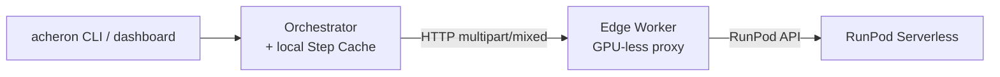

# Acheron

## What is Acheron

Acheron is a distributed asynchronous audio-transformation pipeline that converts EPUB or audio input into chapterized audiobooks in a target language.

## Prerequisites

**System:**

- Python 3.14+
- [uv](https://docs.astral.sh/uv/) (package manager)
- [just](https://just.systems/) (command runner)
- [direnv](https://direnv.net/) (optional, auto-activates the local venv via `.envrc`)
- Docker and Docker Compose

**CLI:**

- `acheron` (for submitting and monitoring jobs)
- `runpodctl` (operators only, for creating RunPod serverless endpoints)

## Quick Start

```bash
cp .env.example .env
docker compose up --build
```

The stack comes up with these default services:

- **Orchestrator** at `https://localhost:8000`. TLS is auto-enabled because the `certs-init` one-shot service generates a self-signed CA and per-service certs into `./certs/` on first run, and the compose file mounts them into every container.
- **Dashboard** at `http://localhost:8080`.
- **Redis** on `localhost:6379`.
- **Local stub workers** (TTS, ASR, translation, gRPC) auto-register with the orchestrator and return mock data. Replace with real GPU workers for production.

## Basic CLI Commands

```bash
# Submit an EPUB
acheron job submit book.epub --src en --dest es

# Submit an audio file (requires an ASR model)
acheron job submit podcast.mp3 --src en --dest es --asr whisper-v3

# Check job status
acheron job status job-xyz
acheron job status job-xyz --verbose

# Resume a job (reuses cached step outputs)
acheron job resume job-xyz
# Resume from scratch (discards the step cache)
acheron job resume job-xyz --force-fresh

# System overview
acheron status
acheron jobs --active
acheron jobs --completed

# Registered workers
acheron workers

# Supported language pairs
acheron capabilities --src en --dest es
```

## Dashboard

The dashboard is an HTMX-based web UI for live monitoring at `http://localhost:8080`. It polls the orchestrator for job status, worker health, and cost.

## Development

The `Justfile` defines the development workflow. Run `just` to list all targets.

- `just validate` — full pipeline: `lint-strict`, `lint-imports`, `type-check` (mypy), `type-check-pyright` (basedpyright), `test`.
- `just lint-strict` — auto-format and ruff check.
- `just lint-imports` — enforce import boundaries (no `core/` → `shell/`, no `worker_sdk/` → `shell/`, no `workers/` → `shell/`).
- `just type-check` — mypy on `src/`, `tests/`, and worker packages.
- `just type-check-pyright` — basedpyright (matches editor LSP).
- `just test` — pytest.
- `just proto` — regenerate protobuf code after editing `proto/synthesis.proto`.
- `just certs` — regenerate the dev TLS CA and per-service certs in `./certs/`. Not needed for `docker compose up`; the `certs-init` service does this automatically.
- `just build-worker <name>` — build a RunPod worker image locally for dev iteration. CI publishes images to `ghcr.io` on pushes to `main` and version tags.
- `just build-edge` — build the generic edge image (`acheron-worker-edge`).

## Architecture



(Step Cache lives inside the orchestrator's `ACHERON_DATA_DIR`; it is a sub-component of the orchestrator, not a separate downstream node. Render the diagram at [mermaid.live](https://mermaid.live/) if it does not load in your viewer.)

The orchestrator's local in-process CPU handlers (`EXTRACTION`, `CHUNKING`, `PACKAGING`) run on the orchestrator host; only GPU-bearing steps (TTS, ASR, translation) traverse the Edge Worker.

### Serverless GPU Workers

GPU inference runs in [RunPod Serverless](https://www.runpod.io/serverless-gpu) endpoints. Endpoints scale to `0` GPU instances when idle and cold-start on a job's arrival, so there is no always-on GPU cost. A worker image boots on demand, serves the job, then shuts down on the endpoint's idle timeout. Cold starts amortize across requests when the model weights are pre-loaded on a Network Volume; subsequent jobs in the same window skip the multi-GB download.

### Edge Workers (GPU-less Proxies)

The GPU containers inside RunPod Serverless are addressable only via RunPod's API — they do not expose `/health` or `/execute` directly and do not register back to Acheron. An **Edge Worker** is a lightweight, GPU-less container with HTTP(S) reachability to the orchestrator that:

1. Registers with the orchestrator at startup (`register_with_orchestrator` in `src/acheron/worker_sdk/registration.py`).
2. Serves `GET /health`, `GET /capabilities`, and `POST /execute` locally (mounted from the inner `EdgeApp` in `src/acheron/worker_sdk/app.py`).
3. Forwards `/execute` payloads to the configured RunPod endpoint via `RunPodForwarderHandler` and returns the result artifacts (`src/acheron/worker_sdk/cloud.py`).
4. Queries RunPod's GraphQL API on schedule (`RunPodPrice.refresh()`) to discover the endpoint's active GPU type and hourly rate (`src/acheron/worker_sdk/pricing.py`).

### Local In-Process Handlers (CPU)

The orchestrator runs in-process handlers for three orchestration steps that do not need a GPU. They are auto-registered at orchestrator startup (see `src/acheron/shell/orchestrator.py:152-170`); a user-registered worker of the same type takes precedence and shadows the built-in.

- **`EXTRACTION`** — EPUB chapter extraction or audio file copy (`ExtractionHandler` in `src/acheron/shell/local_handlers.py`).
- **`CHUNKING`** — text segmentation with a default `max_chunk_length` of **250 characters** per chunk (`ChunkingHandler`). Configurable under `workers.chunking.max_chunk_length` in `acheron.yaml`.
- **`PACKAGING`** — FFmpeg concat demuxer produces `.m4b` audiobooks with bitrate `128k` and codec `aac` by default (`PackagingHandler`). Configurable under `workers.packaging.{bitrate,codec}`.

### Local GPU Workers — Not Implemented

There is currently no path to run a GPU worker on the orchestrator host or on a separate GPU host you manage. All GPU inference goes through RunPod Serverless via an Edge Worker proxy; the handlers in `workers/qwen3tts/`, `workers/granite_speech/`, and `workers/translategemma/` only run inside the RunPod serverless runtime image.

### Worker SDK & Transports

The `worker_sdk` package is the framework every Layer 8 worker implements. Each handler is a `WorkerHandler` subclass with four methods (`src/acheron/worker_sdk/handler.py`):

- `capabilities()` — return the worker's static `WorkerCapabilities` (no I/O, sync).
- `handle(job, input=None)` — run inference for `job`, consuming an optional audio `Input`.
- `startup()` — async hook for model load / cache warmup; runs before any dispatch.
- `shutdown()` — async hook to release GPU memory at container teardown.

Three transports connect a worker to the orchestrator:

- **HTTP `multipart/mixed`** (default) — the orchestrator's `HttpWorker` POSTs an `ExecuteRequest` and parses a `multipart/mixed` body back, one binary part per `Artifact`. File-backed payloads (e.g., WAV on disk) stream in **64 KiB chunks** via `aiofiles` (`src/acheron/worker_sdk/artifacts.py:75`, `src/acheron/worker_sdk/inputs.py:76`); byte-backed artifacts (e.g., per-chapter WAVs) are sent as a single part. The orchestrator materializes received parts into its own `ACHERON_DATA_DIR` (`src/acheron/shell/transports/_multipart.py`), so workers and the orchestrator do not need a shared filesystem.
- **gRPC** — the `GrpcWorker` transport uses the same `Artifact` schema over a protobuf-defined `ExecuteRequest`/`ExecuteResponse` (`proto/synthesis.proto`).
- **Local** — direct in-process invocation, used by the built-in `EXTRACTION` / `CHUNKING` / `PACKAGING` handlers and the integration test suite.

Per-worker configuration is driven by a `worker.yaml` file, searched in this order (`src/acheron/worker_sdk/config_loader.py`):

1. `$WORKER_CONFIG` env var (explicit path).
2. `<cwd>/<worker_name>.worker.yaml`, where `worker_name` comes from `$WORKER_NAME` or the current directory's basename.
3. `<cwd>/worker.yaml`.

Env vars prefixed with `ACHERON_WORKER__` override YAML values at runtime, so the same image can be retargeted without rebuilding. **Three fields are env-only** — they are rejected when supplied via YAML or constructor and must come from `os.environ` (`src/acheron/worker_sdk/settings.py:26-32`):

- `ACHERON_WORKER__REGISTRATION_TOKEN`
- `ACHERON_WORKER__RUNPOD_API_KEY`
- `ACHERON_WORKER__RUNPOD_ENDPOINT_ID`

### Data Flow, Concurrency, and Batching

**Data Hierarchy.** A plan's data moves through five granularities, each materialised under the orchestrator's `ACHERON_DATA_DIR`:

- **Book** — the raw input (`.epub` or `.mp3`).
- **Chapter** — split files from extraction, named `chapter_001.txt`.
- **Chunk** — sub-divided text segments, max **250 characters** by default, compiled into a `chunks.json` manifest.
- **WAV fragment** — the per-chunk TTS output, named `chapter_001_0000.wav`.
- **Audiobook** — re-merged and packaged chapters in `.m4b` format.

**Streaming Executor & Bounded Queues.** Downstream steps (translation, TTS) have hard data dependencies on their immediate upstream step — they cannot begin until the upstream step's first chunk is available. The streaming executor models the plan as a linear pipeline of stages connected by bounded `asyncio.Queue`s, which provide backpressure between stages. The defaults are `queue_size=4` and `step_timeout=1800.0` seconds (`src/acheron/shell/executors/streaming.py:53-54`). All stages run concurrently inside a single outer `asyncio.TaskGroup` (`src/acheron/shell/executors/streaming.py:96`), so a failure in any stage raises a `BaseExceptionGroup` and cancels the others instantly.

**GPU Batching.** Workers advertise a static `batch_capable` flag in their `WorkerCapabilities`:

- `qwen3tts` — `batch_capable=True` (`workers/qwen3tts/handler.py:113`); the whole job's chunks are synthesised in one batched model call against `Qwen/Qwen3-TTS-12Hz-1.7B-CustomVoice`.
- `translategemma` — `batch_capable=True` (`workers/translategemma/handler.py:133`); the whole job's chunks are translated in one batched call against `google/translategemma-12b-it`.
- `granite_speech` — `batch_capable=False` (`workers/granite_speech/handler.py:57`); ASR transcribes per audio file against `ibm-granite/granite-speech-4.1-2b`.

**Multipart Transport.** File-backed `Input` and `Artifact` paths stream in **64 KiB** parts via `multipart/mixed` between the Orchestrator and Edge Worker, instead of buffering the full file in worker RAM. The per-chunk read uses `aiofiles.open(...)` with `await f.read(64 * 1024)` in a loop (`src/acheron/worker_sdk/artifacts.py:71-77`, `src/acheron/worker_sdk/inputs.py:72-78`). Byte-backed payloads (e.g., in-memory `BytesArtifact`s) round-trip as a single part.

## RunPod Serverless Deployment

This section assumes you already have a RunPod account and the [runpodctl](https://github.com/runpod/runpodctl) CLI configured. See the [RunPod API reference](https://docs.runpod.io/api-reference) for the full endpoint / template / network-volume schema.

**Network Volume for HF cache.** GPU workers re-download the model on every cold start unless the weights are already on disk. Mount a RunPod Network Volume into the worker template, SSH into a pod that has the volume attached, and pre-warm the Hugging Face cache once:

```bash
huggingface-cli download Qwen/Qwen3-TTS-12Hz-1.7B-CustomVoice
huggingface-cli download ibm-granite/granite-speech-4.1-2b
huggingface-cli download google/translategemma-12b-it
```

Subsequent cold starts that mount the same Network Volume find the weights in the cache and skip the multi-GB download.

**Template configuration.** When you create the RunPod serverless template, set `containerDiskInGb` to at least **10 GB** to hold the image, runtime, and any working files. Pick a GPU type that meets the VRAM guidance below; the model is selected on the endpoint, not in code.

**Endpoint creation.** Create one Serverless endpoint per worker type, pointing the endpoint's `templateId` at the image published by CI:

- `ghcr.io/<repo>/acheron-qwen3tts-runpod:<tag>` (TTS)
- `ghcr.io/<repo>/acheron-granite-speech-runpod:<tag>` (ASR)
- `ghcr.io/<repo>/acheron-translategemma-runpod:<tag>` (translation)

The GHCR image is public; RunPod can pull it without a `containerRegistryAuthId` ([GitHub Packages docs](https://docs.github.com/en/packages/learn-github-packages/configuring-a-packages-access-control-and-visibility)). Set the endpoint's:

- `workersMin: 0` — scale to zero on idle so you don't pay for an idle GPU.
- `workersMax: 1` — raise if you need concurrent fan-out; each worker is a full GPU instance.
- `idleTimeout` (or `executionTimeoutMs`, depending on the API version) — a short value (e.g., 5 minutes / 300 s) keeps shutdown aggressive; the Network Volume absorbs cold-start cost, not boot-loop cost. The exact field name on `POST /endpoints` is `executionTimeoutMs` ([RunPod API reference](https://docs.runpod.io/api-reference/endpoints/POST/endpoints)).

The Edge Worker reads its endpoint id from `ACHERON_WORKER__RUNPOD_ENDPOINT_ID` and points `/execute` calls at it.

## GPU & VRAM Guidance

The numbers below are rules of thumb, not guarantees. The Hugging Face model card is the authoritative source for each model's VRAM requirements — check it before sizing a GPU.

- **TTS** ([`Qwen/Qwen3-TTS-12Hz-1.7B-CustomVoice`](https://huggingface.co/Qwen/Qwen3-TTS-12Hz-1.7B-CustomVoice)) / **ASR** ([`ibm-granite/granite-speech-4.1-2b`](https://huggingface.co/ibm-granite/granite-speech-4.1-2b)) — 1.7B and 2B speech-language models. A 24 GB GPU (L4, A5000, RTX 3090) is the practical baseline; the Qwen3-TTS card recommends FlashAttention 2 to reduce memory.
- **Translation** ([`google/translategemma-12b-it`](https://huggingface.co/google/translategemma-12b-it)) — a 12B multimodal translation model. 24 GB+ VRAM is the community-cloud baseline; Secure Cloud may be required at higher concurrency or batch size. The card states the model is designed to be deployable on resource-constrained hardware, so the exact number depends on batch size and KV-cache pressure. Consult the model card before sizing.

## Edge Worker Proxy Setup

The edge container is the GPU-less proxy that registers with the orchestrator and forwards `/execute` to the RunPod endpoint. The image is the same for every worker type — only the handler import path and `worker.yaml` differ.

**Profile-based opt-in.** Real GPU workers are gated behind Docker Compose profiles so a default `docker compose up` stays self-contained:

```bash
docker compose --profile runpod-tts up --build
docker compose --profile runpod-asr up --build
docker compose --profile runpod-translation up --build
```

The profile names (`runpod-tts`, `runpod-asr`, `runpod-translation`) and the corresponding services (`qwen3tts-edge`, `granite-speech-edge`, `translategemma-edge`) are declared in `docker-compose.yml:198, 231, 265`. Services with no `profiles:` key start unconditionally; services with a profile start only when the profile is active.

**Primary config is `worker.yaml`.** Each worker ships two YAMLs: a cloud-side `worker.yaml` (used by the RunPod runtime image) and an `worker.edge.yaml` (used by the `acheron-worker-edge` generic image). The edge-side file is bundled into `Dockerfile.edge` and read by the `acheron-worker-edge` image at startup. Operator-tunable keys, all optional in YAML (env-var overrides always win):

- `worker_id` — stable identifier for this worker instance (also overridable as `ACHERON_WORKER__WORKER_ID`).
- `orchestrator_url` — orchestrator URL the worker registers with and sends `/execute` to.
- `listen_host` / `listen_port` — bind interface and port for the edge's HTTP/gRPC server (defaults `0.0.0.0` / `8001`).
- `execution_timeout_s` — per-step execution timeout, default `1800` seconds.
- `price_source` — `runpod` (auto-discover via RunPod GraphQL), `static` (fixed `dollars_per_hour`), or `zero` (stubs/local).
- `secure_cloud` — when `price_source == "runpod"`, quote Secure Cloud (`true`) or Community Cloud (`false`) rates.
- `default_speaker` — TTS only: the default Qwen3-TTS speaker. `Ryan` is the english-language default in the shipped `qwen3tts/worker.yaml`.
- `per_language_defaults` — TTS only: a `language → speaker` map. Set in `worker.yaml`, not as an env var (pydantic-settings `dict` fields don't bind cleanly to env strings).
- `output_mode` — `multipart` (stream bytes over HTTP) or `volume` (write to a shared volume).
- `output_volume_dir` — required when `output_mode == "volume"`. Ignored otherwise.
- `model_id` — override the model id the handler loads (e.g., `Qwen/Qwen3-TTS-12Hz-1.7B-CustomVoice`).
- `handler` — Python import path to the worker handler class, used by `acheron-worker-edge` to import the handler when the cloud-side module is bundled.
- `phantom_handler` — edge-only: cloud-side handler class used solely to read static `capabilities()` (no model load).

**Secrets are env-only.** `ACHERON_WORKER__REGISTRATION_TOKEN`, `ACHERON_WORKER__RUNPOD_API_KEY`, and `ACHERON_WORKER__RUNPOD_ENDPOINT_ID` are rejected when supplied via `worker.yaml` or as constructor kwargs (`src/acheron/worker_sdk/settings.py:26-32`). Set them in `.env` or your secret store.

## GPU & Pricing Auto-Discovery

The Edge Worker does not configure `gpu_type` — RunPod is the source of truth. `RunPodPrice` (in `src/acheron/worker_sdk/pricing.py`) queries RunPod's GraphQL API on schedule to discover the endpoint's active GPU type and hourly rate.

- **Cache TTL** is `ACHERON_WORKER__PRICE_CACHE_TTL_S` (default `3600` seconds). When a job arrives and the cached rate is older than the TTL, `RunPodPrice.estimate()` triggers a refresh before computing the cost. GPU changes on the endpoint take effect on the next refresh — no image rebuild.
- **Fault-tolerance.** A refresh failure returns `False` from `refresh()` and the cached rate is reused under the `CACHED` `CostBasis` (defined in `src/acheron/core/models.py:68-74`). If no rate is cached at all, the basis is `UNKNOWN` and `cost_estimate` is `None`. The job is never blocked by a missing price; cost reporting degrades, not execution.
- **Static and zero sources.** `price_source: "static"` quotes a fixed `DOLLARS_PER_HOUR` (basis `STATIC`); `price_source: "zero"` reports `$0` (basis `STATIC`, used by the local stub workers in the dev compose stack).

## TLS & Hardening

**Defaults in the codebase.** TLS is opt-in. Setting `ACHERON_TLS_CERT_FILE` and `ACHERON_TLS_KEY_FILE` together enables HTTPS; setting only one is an error and the orchestrator refuses to start (`src/acheron/tls.py:30-38`). If both are unset, `uvicorn_ssl_kwargs()` logs exactly this warning before serving plain HTTP:

> "ACHERON_TLS_CERT_FILE and ACHERON_TLS_KEY_FILE are unset — serving plain HTTP. Set both to enable HTTPS, or set ACHERON_ALLOW_INSECURE=1 to silence this warning."

The Docker Compose stack auto-enables TLS by mounting self-signed certs from the `certs-init` service into every container (`docker-compose.yml:37-40`), so local dev always runs HTTPS. The first `docker compose up` materialises `./certs/`; `just certs` regenerates it manually.

**Production.** Mount real certs (Let's Encrypt via cert-manager, your CA, etc.) with the right SANs, and set both env vars on the orchestrator. No Acheron code change is required.

**Client-side trust.** Set `ACHERON_TLS_CA_FILE` to the CA bundle; `tls.py:79` falls back to the standard `SSL_CERT_FILE` (honoured by httpx and the Python `ssl` stdlib) if the Acheron-specific var is unset. The CLI additionally falls back to `./certs/acheron-ca.crt` in the current directory when present (`src/acheron/cli.py:50-53`), so local dev just works without any trust-store configuration.

**Disabling TLS.** Unset the cert/key env vars. To silence the WARNING when plain HTTP is intentional, set `ACHERON_ALLOW_INSECURE=1` (`src/acheron/tls.py:22-23, 50-55`). The same flag silences the analogous WARNING emitted by `grpc_channel()` when `ACHERON_TLS_CA_FILE` is unset.

**Reverse proxy (optional).** Acheron does not ship a proxy. If you want to terminate TLS at a reverse proxy instead of in-process, point nginx, Caddy, or anything else at the orchestrator (HTTPS) and the dashboard (HTTP), and terminate TLS there. The `ACHERON_TLS_*` env vars are independent of any proxy you add — leaving them unset serves plain HTTP from Acheron itself, which is fine when the proxy handles TLS in front.

## YAML Configuration

The orchestrator reads `acheron.yaml` for non-secret settings. The config search order, with first match winning (`src/acheron/shell/config.py:84-95`):

1. `$ACHERON_CONFIG_PATH` — explicit path to a YAML file.
2. `./acheron.yaml` or `./acheron.yml` — repo-local config.
3. `/etc/acheron/acheron.yaml` or `/etc/acheron/acheron.yml` — system-wide config.

**Top-level blocks.**

- `orchestrator:` — `data_dir`, `registration_token`, `health_check_interval_seconds`.
- `workers:` — `chunking` (`max_chunk_length`) and `packaging` (`bitrate`, `codec`, `max_fmt_chunk_length`).
- `providers:` — RunPod and Hugging Face API keys for decoupled health checks when a worker's HTTP probe fails.
- `chars_per_token` — top-level CJK worst-case estimate for chunk-fit validation; default `1`.

`${VAR}` references in the YAML are expanded from `os.environ` at load time (`src/acheron/shell/config.py:18-26`), so `api_key: "${RUNPOD_API_KEY}"` in `acheron.yaml.example` is the recommended pattern for keys that should not be committed.

**Env-var overrides.** Use `__` (double underscore) to address nested keys: `ACHERON_ORCHESTRATOR__DATA_DIR` overrides `orchestrator.data_dir`. The env-var source is layered above the YAML source in `settings_customise_sources` (`src/acheron/shell/config.py:146-160`), so env vars always win over file values. Flat aliases `ACHERON_DATA_DIR` and `ACHERON_REGISTRATION_TOKEN` also work for orchestrator-level settings.

An example template is in `acheron.yaml.example`. Copy it to start:

```bash
cp acheron.yaml.example acheron.yaml
```

## Configuration Reference

The authoritative table of every Acheron environment variable. Grouped by surface; defaults verified against the source at `README.md` commit time. `ACHERON_WORKER__*` is a `__` (double underscore) separator throughout.

| Group | Variable | Default | Description |
| ---- | -------- | ------- | ----------- |
| Orchestrator / URLs | `ACHERON_URL` | `https://localhost:8000` | CLI and dashboard: orchestrator URL. Use `http://` to skip TLS. |
| Orchestrator / Registration | `ACHERON_REGISTRATION_TOKEN` | (auto-generated) | Worker registration shared secret. If unset, the orchestrator generates a secure token on startup and writes it to `{data_dir}/.registration_token` (`src/acheron/shell/orchestrator.py:207-225`). |
| Orchestrator / Registration | `ACHERON_OPEN_REGISTRATION` | (unset) | Set to `1` to enable open worker registration (bypasses token checks, useful for local dev). |
| Orchestrator / Config | `ACHERON_CONFIG_PATH` | (unset) | Custom path to the YAML configuration file (searches `acheron.yaml` / `acheron.yml` if unset). |
| Orchestrator / Storage | `ACHERON_DATA_DIR` | `/data/jobs` | Orchestrator: plan and step-output cache directory (must be writable; orchestrator fails fast at startup if not). |
| Orchestrator / Storage | `ACHERON_STORE_BACKEND` | `memory` | Orchestrator: `memory` (in-process, dev) or `redis` (persistent, production). |
| Orchestrator / Storage | `REDIS_URL` | `redis://localhost:6379` | Redis connection (used when `ACHERON_STORE_BACKEND=redis`). |
| Orchestrator / TLS | `ACHERON_TLS_CERT_FILE` | (unset) | Server: path to PEM-encoded server cert. Set with `ACHERON_TLS_KEY_FILE` to enable HTTPS. |
| Orchestrator / TLS | `ACHERON_TLS_KEY_FILE` | (unset) | Server: path to PEM-encoded server key. Set with `ACHERON_TLS_CERT_FILE` to enable HTTPS. |
| Orchestrator / TLS | `ACHERON_TLS_CA_FILE` | (unset) | gRPC and CLI clients: path to PEM-encoded CA bundle to verify peer certs. Falls back to `SSL_CERT_FILE`, then `./certs/acheron-ca.crt` in the CLI's CWD. |
| Orchestrator / TLS | `ACHERON_ALLOW_INSECURE` | (unset) | Set to `1` to silence the plain-HTTP / insecure-gRPC WARNINGs emitted by `tls.py` when TLS env vars are unset. |
| Dashboard | `ACHERON_TRUST_REVERSE_PROXY` | `0` | Set to `1` to trust the `X-Forwarded-User` header from a reverse proxy that authenticates and strips the header. Default `0` (unauthenticated). |
| Worker / Transport | `ACHERON_WORKER__WORKER_ID` | (required) | Stable identifier for this worker instance. |
| Worker / Transport | `ACHERON_WORKER__ORCHESTRATOR_URL` | (required) | Orchestrator URL the worker registers with and sends `/execute` to. |
| Worker / Transport | `ACHERON_WORKER__LISTEN_HOST` | `0.0.0.0` | Bind host for the worker's HTTP/gRPC server. |
| Worker / Transport | `ACHERON_WORKER__LISTEN_PORT` | `8001` | Bind port for the worker's HTTP/gRPC server. |
| Worker / Transport | `ACHERON_WORKER__EXECUTION_TIMEOUT_S` | `1800` | Per-step execution timeout. |
| Worker / Transport | `ACHERON_WORKER__OUTPUT_MODE` | `multipart` | `multipart` (stream bytes over HTTP) or `volume` (write to shared volume). |
| Worker / Transport | `ACHERON_WORKER__OUTPUT_VOLUME_DIR` | (unset) | Required when `output_mode == "volume"`. |
| Worker / Dispatch | `ACHERON_WORKER__HANDLER` | (unset) | Python import path to the worker handler class (used by `acheron-worker-edge` generic CLI). |
| Worker / Dispatch | `ACHERON_WORKER__MODEL_ID` | (unset) | Override the model id the handler loads (e.g., `Qwen/Qwen3-TTS-12Hz-1.7B-CustomVoice`). |
| Worker / Dispatch | `ACHERON_WORKER__PHANTOM_HANDLER` | (unset) | Edge-only: cloud-side handler class used solely to read static `capabilities()` (no model load). |
| Worker / Dispatch | `ACHERON_WORKER__LOG_LEVEL` | `INFO` | Standard logging level. |
| Worker / Secrets (env-only) | `ACHERON_WORKER__REGISTRATION_TOKEN` | (unset) | Bearer token for `Authorization` header on registration. Env-only — rejected when supplied via YAML or constructor. |
| Worker / Secrets (env-only) | `ACHERON_WORKER__RUNPOD_API_KEY` | (unset) | RunPod account API key for the GraphQL pricing endpoint. Env-only. |
| Worker / Secrets (env-only) | `ACHERON_WORKER__RUNPOD_ENDPOINT_ID` | (unset) | RunPod serverless endpoint id to forward `/execute` to. Env-only. |
| Worker / Pricing | `ACHERON_WORKER__PRICE_SOURCE` | `runpod` | `runpod` (auto-discover from RunPod GraphQL), `static` (fixed `DOLLARS_PER_HOUR`), or `zero` (stubs/local). |
| Worker / Pricing | `ACHERON_WORKER__SECURE_CLOUD` | `false` | When `price_source == "runpod"`, quote Secure Cloud (true) or Community Cloud (false) rates. |
| Worker / Pricing | `ACHERON_WORKER__DOLLARS_PER_HOUR` | (unset) | Required when `price_source == "static"`. |
| Worker / Pricing | `ACHERON_WORKER__PRICE_CACHE_TTL_S` | `3600` | RunPod rate cache TTL. Refreshed on demand when stale. |
| Worker / Cloud transport | `ACHERON_WORKER__RUNPOD_BASE_URL` | (unset) | Override the RunPod API base URL (e.g., for testing). |
| Worker / TTS | `ACHERON_WORKER__DEFAULT_SPEAKER` | `Ryan` | Default Qwen3-TTS speaker. Per-language defaults via `per_language_defaults` (set in YAML). |
| Worker / TTS | `ACHERON_WORKER__PER_LANGUAGE_DEFAULTS` | (unset) | JSON dict of language → speaker overrides. Set in `worker.yaml` rather than env. |

## License

GPL-3.0-only
