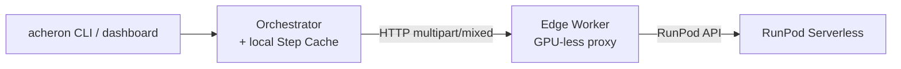

# README.md Redesign Implementation Plan

> **For agentic workers:** REQUIRED SUB-SKILL: Use superpowers:subagent-driven-development (recommended) or superpowers:executing-plans to implement this plan task-by-task. Steps use checkbox (`- [ ]`) syntax for tracking.

**Goal:** Rewrite `README.md` from scratch per the revised design spec at `docs/superpowers/specs/2026-06-24-readme-redesign-design.md`.

**Architecture:** Single-file Markdown rewrite. Three-tier progressive model (Tier 1: Quick Start & CLI; Tier 2: Conceptual Architecture & Streaming; Tier 3: Operator Deployment & Configuration Reference). The "test" for this work is verification — every command, env var, file path, port, config key, and third-party claim in the README must be confirmed against the codebase or authoritative current docs before commit.

**Tech Stack:** Markdown, Mermaid (architecture diagram), the existing Acheron Python codebase (no code changes — this plan touches `README.md` only).

---

## Hard Rules (Read Before Starting)

1. **Verify every third-party claim before writing it.** Before any sentence that references a third-party library, service, CLI tool, SDK, or cloud platform, fetch current authoritative docs:
   - **Use the `find-docs` skill** (`skills/find-docs/SKILL.md`) for any general library, framework, SDK, API, CLI tool, or cloud service — even well-known ones like Docker, `just`, `uv`, `direnv`, Mermaid, GitHub Container Registry, Python `ssl`/`asyncio`, `aiofiles`, `httpx`.
   - **Use the `deepwiki` MCP tools** (`deepwiki_ask_question`, `deepwiki_read_wiki_contents`, `deepwiki_read_wiki_structure`) for GitHub-hosted project wikis and reference repos.
   - **Fetch Hugging Face model cards directly** via `webfetch` for any model-specific claim (id strings, capabilities, recommended hardware).
   - **Fetch vendor docs directly** for RunPod Serverless, Docker Compose, GitHub Actions, etc.
   - **Never rely on training data for API syntax, config keys, version-specific behavior, CLI flags, or model capabilities.** The README rots fast if these are wrong, and the cost of a wrong claim is higher than the cost of a 30-second lookup. This is a hard rule, not a guideline.
2. **Every command, env var, file path, port, and config key in the README must be verified to exist in the codebase** before the file is committed. The Verification Task contains the full cross-check checklist.
3. **No legacy fallbacks or "this used to be" notes.** Acheron is greenfield. Write the current truth only.
4. **No placeholders in the final README.** "TBD", "FIXME", "see later", "TBA" are not allowed. Every section, link, code block, and table cell is final at commit time.
5. **Commit per Tier, not at the end.** Tier 1, Tier 2, Tier 3, and the verification pass each get their own commit. Do not bundle.
6. **Use Conventional Commits.** Scope: `docs(readme)`. Subject: imperative, ≤ 72 chars. Body: short bulletpoints if needed.

---

## File Structure

| File | Status | Responsibility |
|------|--------|----------------|
| `README.md` | Modify (full rewrite) | The single deliverable. Replaces the existing 233-line README. |

No other files are created or modified by this plan. No tests are added (this is a documentation task; the Verification Task is the test).

---

## Task 1: Tier 1 — Quick Start & CLI User Guide

**Files:**
- Modify: `README.md` (full rewrite, starting with Tier 1)

**Third-party lookups required before writing this task:**
- [ ] `direnv allow` semantics — `find-docs` skill, query: "direnv allow how it works venv activation"
- [ ] `just` command runner install + usage — `find-docs` skill, query: "just command runner install usage"
- [ ] `uv sync --all-extras` semantics — `find-docs` skill, query: "uv sync all extras"
- [ ] `docker compose up --build` profile behavior — `find-docs` skill, query: "docker compose profile up"
- [ ] GHCR anonymous pull — `find-docs` skill, query: "ghcr.io docker pull anonymous public"
- [ ] Hugging Face `huggingface-cli download` — `find-docs` skill, query: "huggingface-cli download network volume cache"

- [ ] **Step 1: Move the current README to a backup for reference**

```bash
cp README.md /tmp/opencode/README-original.md
```

- [ ] **Step 2: Truncate `README.md` to a single header**

Overwrite `README.md` with:

```markdown
# Acheron
```

Commit:
```bash
git add README.md
git commit -m "docs(readme): truncate to header before rewrite"
```

- [ ] **Step 3: Write Tier 1 — What Acheron is**

Append a "## What is Acheron" paragraph. Keep it ≤ 60 words. State: distributed asynchronous audio-transformation pipeline that converts EPUB or audio input into chapterized audiobooks in a target language. No new claims, no marketing language.

- [ ] **Step 4: Write Tier 1 — Prerequisites**

Append `## Prerequisites`. Two sub-lists:
- **System:** Python 3.14+, [uv](https://docs.astral.sh/uv/), [just](https://just.systems/), [direnv](https://direnv.net/) (optional, auto-activates venv), Docker and Compose.
- **CLI:** `acheron` (for submitting/monitoring jobs), `runpodctl` (operators only, for creating RunPod endpoints).

Verify each tool's link resolves to its current official site. Verify `python --version` policy in `pyproject.toml` (`requires-python`).

- [ ] **Step 5: Write Tier 1 — Quick Start (Local Dev)**

Append `## Quick Start`. Content per spec §2 Tier 1 "Quick Start (Local Dev)":
```bash
cp .env.example .env
docker compose up --build
```
Default services list with URLs/ports. Explain the `certs-init` one-shot service in one sentence (cross-check against `docker-compose.yml:19-25`).

- [ ] **Step 6: Write Tier 1 — Basic CLI Commands**

Append `## Basic CLI Commands`. The exact commands from the spec:
- `acheron job submit book.epub --src en --dest es`
- `acheron job submit podcast.mp3 --src en --dest es --asr whisper-v3`
- `acheron job status job-xyz`, `acheron job status job-xyz --verbose`
- `acheron job resume job-xyz`, `acheron job resume job-xyz --force-fresh`
- `acheron status`, `acheron jobs --active`, `acheron jobs --completed`
- `acheron workers`
- `acheron capabilities --src en --dest es`

For each command, verify it exists in `src/acheron/cli.py` (grep for the verb) and that all flags are accepted. Do not invent flags.

- [ ] **Step 7: Write Tier 1 — Dashboard**

Append `## Dashboard`. One short paragraph: HTMX-based web UI at `http://localhost:8080` for live monitoring. Cross-check the port and tech stack against `docker-compose.yml:60-83` and `dashboard/app.py`.

- [ ] **Step 8: Write Tier 1 — Development (key `just` targets)**

Append `## Development`. List the targets from the spec, each with its one-line purpose. For each, verify the target exists in `Justfile` and the description matches the actual recipe. Do not paraphrase recipes — read them.

- [ ] **Step 9: Markdown lint Tier 1**

Run the project's configured Markdown linter (check `Justfile` and `pyproject.toml` for a markdownlint/prettier/rumdl config). If none is configured, run `uv run ruff check README.md` to confirm no Python-markdown issues, and note the absence of a markdown-specific linter in the commit body. Fix any issues before commit.

- [ ] **Step 10: Commit Tier 1**

```bash
git add README.md
git commit -m "docs(readme): add Tier 1 — Quick Start & CLI User Guide"
```

---

## Task 2: Tier 2 — Conceptual Architecture & Streaming

**Files:**
- Modify: `README.md` (append Tier 2)

**Third-party lookups required before writing this task:**
- [ ] Mermaid flowchart syntax — `find-docs` skill, query: "mermaid flowchart syntax node shapes arrows LR"
- [ ] `asyncio.TaskGroup` cancellation semantics — `find-docs` skill (Python docs), query: "asyncio.TaskGroup exception cancellation BaseExceptionGroup"
- [ ] `asyncio.Queue` bounded queue behavior — `find-docs` skill (Python docs)
- [ ] `aiofiles` async file read — `find-docs` skill, query: "aiofiles async file read chunked"
- [ ] Hugging Face model cards (verify id strings and capabilities):
  - `Qwen/Qwen3-TTS-12Hz-1.7B-CustomVoice` — fetch via `webfetch`. Confirm exact id matches what `workers/qwen3tts/handler.py:55` advertises.
  - `ibm-granite/granite-speech-4.1-2b` — fetch via `webfetch`. Confirm exact id matches `workers/granite_speech/handler.py:30`.
  - `google/translategemma-12b-it` — fetch via `webfetch`. Confirm exact id matches `workers/translategemma/handler.py:29`.

- [ ] **Step 1: Write Tier 2 — Mermaid Architecture Diagram**

Append `## Architecture`. The diagram per spec:
````markdown

````
The parenthetical note about Step Cache follows as one sentence. Verify the Mermaid syntax renders correctly by pasting into a Mermaid live editor (link to verify via `find-docs`).

- [ ] **Step 2: Write Tier 2 — Serverless GPU Workers**

Append a `### Serverless GPU Workers` paragraph. Conceptual only — no commands. State the scale-to-zero / cold-start economics.

- [ ] **Step 3: Write Tier 2 — Edge Workers (GPU-less Proxies)**

Append `### Edge Workers (GPU-less Proxies)`. Explain why Edge Workers exist (RunPod GPU workers don't expose `/health` or `/execute` directly, don't register back). Verify the four responsibilities (register, serve `/health`+`/execute`, forward to RunPod, query pricing) by reading `src/acheron/worker_sdk/app.py` and `cloud.py`.

- [ ] **Step 4: Write Tier 2 — Local In-Process Handlers (CPU)**

Append `### Local In-Process Handlers (CPU)`. List EXTRACTION (EPUB parse / audio copy), CHUNKING (text segmentation, default 250 chars), PACKAGING (FFmpeg → `.m4b`). State auto-registration at startup. Verify against `src/acheron/shell/orchestrator.py:152-170` and `src/acheron/shell/local_handlers.py`.

- [ ] **Step 5: Write Tier 2 — Local GPU Workers — Not Implemented**

Append `### Local GPU Workers — Not Implemented`. One paragraph: no path exists to run a GPU worker on the orchestrator host or on a separate GPU host; all GPU inference goes through RunPod serverless via an Edge Worker proxy.

- [ ] **Step 6: Write Tier 2 — Worker SDK & Transports**

Append `### Worker SDK & Transports`. Content from spec §2 Tier 2 "Worker SDK & Transports":
- The `worker_sdk` package as the framework every Layer 8 worker implements (`WorkerHandler` ABC with `capabilities()`, `handle()`, `startup()`, `shutdown()`).
- Three transports: HTTP `multipart/mixed`, gRPC, Local.
- Per-worker `worker.yaml` config surface.
- Three env-only secrets: `ACHERON_WORKER__REGISTRATION_TOKEN`, `ACHERON_WORKER__RUNPOD_API_KEY`, `ACHERON_WORKER__RUNPOD_ENDPOINT_ID`.

Verify each field name and behavior against `src/acheron/worker_sdk/settings.py` and `src/acheron/worker_sdk/config_loader.py`. Do not paraphrase — quote exact field names.

- [ ] **Step 7: Write Tier 2 — Data Flow, Concurrency, and Batching**

Append `### Data Flow, Concurrency, and Batching`. Four sub-paragraphs from spec:
- **Data Hierarchy:** book → chapter → chunk → WAV fragment → m4b.
- **Streaming Executor & Bounded Queues:** `asyncio.TaskGroup`, bounded queues (default size 4), per-step `step_timeout=1800s`. Verify defaults against `src/acheron/shell/executors/streaming.py:53-54`.
- **GPU Batching:** TTS and translation are `batch_capable=True`; ASR is `batch_capable=False`. Verify against `workers/qwen3tts/handler.py:113`, `workers/translategemma/handler.py:133`, `workers/granite_speech/handler.py:57`.
- **Multipart Transport:** file-backed paths stream in 64 KiB parts via `multipart/mixed`. Verify against `src/acheron/worker_sdk/artifacts.py:75` and `inputs.py:76`.

- [ ] **Step 8: Markdown lint Tier 2**

Run the configured Markdown linter. Fix any issues.

- [ ] **Step 9: Commit Tier 2**

```bash
git add README.md
git commit -m "docs(readme): add Tier 2 — Conceptual Architecture & Streaming"
```

---

## Task 3: Tier 3 — Operator Deployment & Configuration Reference

**Files:**
- Modify: `README.md` (append Tier 3)

**Third-party lookups required before writing this task:**
- [ ] RunPod Serverless endpoint config (`workers_min`, `workers_max`, idle timeout) — `find-docs` skill, query: "runpod serverless endpoint workers_min workers_max idle timeout"
- [ ] RunPod Network Volume setup — `find-docs` skill, query: "runpod network volume template"
- [ ] RunPod GraphQL API (the `myself { endpoints { gpuIds } }` and `gpuTypes` queries) — fetch the current RunPod GraphQL docs. **Do not copy the query strings from the codebase; verify them against RunPod's own API reference.**
- [ ] Docker Compose profiles semantics — `find-docs` skill, query: "docker compose profiles selective service"
- [ ] Hugging Face model cards (for VRAM guidance) — fetch each via `webfetch`. Quote exact id and confirm the recommended-hardware blurb (if any).
- [ ] GitHub Container Registry anonymous pull — `find-docs` skill, query: "ghcr.io anonymous pull public image"
- [ ] Python `SSL_CERT_FILE` standard env var — `find-docs` skill (Python docs), query: "SSL_CERT_FILE environment variable ssl stdlib"
- [ ] Self-signed CA in Python `ssl` — `find-docs` skill, query: "python ssl create_default_context cafile self-signed"
- [ ] Nginx / Caddy reverse proxy TLS termination (briefly, for the optional proxy paragraph) — `find-docs` skill, query: "nginx reverse proxy TLS termination upstream https"

- [ ] **Step 1: Write Tier 3 — RunPod Serverless Deployment**

Append `## RunPod Serverless Deployment`. Three sub-paragraphs from spec:
- **Network Volume for HF cache:** pre-warm with `huggingface-cli download <model>` once.
- **Template configuration:** disk size ≥ 10 GB, GPU selection.
- **Endpoint creation:** `workers_min: 0`, `workers_max: 1`, idle timeout ~300s, point at the GHCR image.

Verify each claim against the current RunPod docs fetched via `find-docs`. Do not state defaults that the RunPod docs themselves don't state as defaults.

- [ ] **Step 2: Write Tier 3 — GPU & VRAM Guidance**

Append `## GPU & VRAM Guidance`. Frame as rule-of-thumb and direct the reader to each model's Hugging Face card for authoritative requirements. Per-model recommendations from spec. For each, verify the recommendation against the model card (fetch via `webfetch`). If a card makes a specific recommendation, prefer the card's wording.

- [ ] **Step 3: Write Tier 3 — Edge Worker Proxy Setup**

Append `## Edge Worker Proxy Setup`. Content from spec:
- Profile-based opt-in: `docker compose --profile runpod-tts up --build` (and `runpod-asr`, `runpod-translation`). Verify profile names against `docker-compose.yml:198, 231, 265`.
- Primary config: `worker.yaml`. Env vars override YAML.
- Operator-tunable keys (from spec).
- Env-only secrets.

- [ ] **Step 4: Write Tier 3 — GPU & Pricing Auto-Discovery**

Append `## GPU & Pricing Auto-Discovery`. From spec. Cross-check defaults and semantics against `src/acheron/worker_sdk/pricing.py` and `src/acheron/core/models.py` (CostBasis enum).

- [ ] **Step 5: Write Tier 3 — TLS & Hardening**

Append `## TLS & Hardening`. From spec:
- Defaults: TLS is opt-in via `ACHERON_TLS_CERT_FILE` + `ACHERON_TLS_KEY_FILE`; both must be set; `tls.py` emits a WARNING if unset.
- Docker Compose: auto-enables TLS via `certs-init`.
- Production: mount real certs, set both env vars.
- Client-side trust: `ACHERON_TLS_CA_FILE` or `SSL_CERT_FILE`.
- Disabling TLS: unset env vars; set `ACHERON_ALLOW_INSECURE=1` to silence the WARNING.
- Reverse proxy: optional; point nginx/Caddy at the orchestrator (HTTPS) and dashboard (HTTP).

Verify each env var name and behavior against `src/acheron/tls.py`. Do not paraphrase WARNING text — quote it.

- [ ] **Step 6: Write Tier 3 — YAML Configuration**

Append `## YAML Configuration`. Precedence, top-level blocks, env-var override syntax, example file reference. Cross-check against `src/acheron/shell/config.py:84-95` and `acheron.yaml.example`.

- [ ] **Step 7: Write Tier 3 — Configuration Reference Table**

Append `## Configuration Reference`. The full grouped table from the spec (30 env vars across 6 groups). For each row, before writing:
- Confirm the env var name (exact spelling, exact prefix) by grepping the codebase.
- Confirm the default by reading the source (pydantic Field default, pydantic-settings default, or hardcoded fallback).
- Confirm the description against the relevant docstring or source comment.

Source files to grep / read for verification: `src/acheron/shell/config.py`, `src/acheron/worker_sdk/settings.py`, `src/acheron/tls.py`, `docker-compose.yml`, `acheron.yaml.example`, `Justfile`, `.env.example`.

- [ ] **Step 8: Add the License section**

Append at the end:
```markdown
## License

GPL-3.0-only
```

Verify the SPDX string by reading `LICENSE` (or the `license` field in `pyproject.toml`).

- [ ] **Step 9: Markdown lint Tier 3**

Run the configured Markdown linter. Fix any issues.

- [ ] **Step 10: Commit Tier 3**

```bash
git add README.md
git commit -m "docs(readme): add Tier 3 — Operator Deployment & Configuration"
```

---

## Task 4: Verification

**Files:**
- Read-only: `README.md`
- Reference: every file in §"Spec-to-code cross-check" below

**Tools required:**
- Configured Markdown linter (if any)
- `grep` for cross-checking env var names, defaults, and field names
- `find-docs` skill and `deepwiki` MCP tools (re-fetch any third-party doc whose answer might have shifted)
- The original `README.md` (kept in `/tmp/opencode/README-original.md` from Task 1 Step 1) for diff context

- [ ] **Step 1: Markdown lint the full file**

Run the configured Markdown linter over the full `README.md`. Fix any issues found.

- [ ] **Step 2: Link check**

For every link in `README.md`:
- Internal file paths: confirm the file exists in the repo (`ls` or `test -f`).
- Internal section anchors: confirm the header exists in the README (`grep` for the slug).
- External links: spot-check the consequential ones (RunPod docs, HF model cards, `just` site, `direnv` site, Mermaid docs, Docker Compose docs, uv docs, Python `ssl` docs) by `curl -I` or by re-fetching via `find-docs`. If any 404 or have changed materially, fix the README.

- [ ] **Step 3: Spec-to-code cross-check**

Walk every quantitative claim in the README and confirm it against the source. Required confirmations:

| Claim | Verify in |
|-------|-----------|
| Tier 1: TLS auto-enabled by `certs-init` | `docker-compose.yml:19-25` |
| Tier 1: ports 8000 (orchestrator), 8080 (dashboard), 6379 (Redis) | `docker-compose.yml:32, 65, 5` |
| Tier 1: stub worker services listed | `docker-compose.yml:85-372` |
| Tier 2: queue size default 4 | `src/acheron/shell/executors/streaming.py:53` |
| Tier 2: `step_timeout=1800s` default | `src/acheron/shell/executors/streaming.py:54` |
| Tier 2: 250-char chunking default | `src/acheron/core/chunking.py:9` and `src/acheron/shell/config.py:40` |
| Tier 2: 64 KiB streaming chunk | `src/acheron/worker_sdk/artifacts.py:75` and `inputs.py:76` |
| Tier 2: local handlers for EXTRACTION/CHUNKING/PACKAGING | `src/acheron/shell/orchestrator.py:152, 153, 158` |
| Tier 2: `batch_capable=True` for TTS, translation; `False` for ASR | `workers/qwen3tts/handler.py:113`, `workers/translategemma/handler.py:133`, `workers/granite_speech/handler.py:57` |
| Tier 2: model id strings match HF | cross-check each against the Hugging Face card fetched in Task 2 |
| Tier 2: Edge Worker handler is `RunPodForwarderHandler` | `workers/qwen3tts/worker.edge.yaml:15` and `src/acheron/worker_sdk/cloud.py` |
| Tier 3: compose profiles `runpod-tts`, `runpod-asr`, `runpod-translation` | `docker-compose.yml:198, 231, 265` |
| Tier 3: `price_cache_ttl_s` default 3600s | `src/acheron/worker_sdk/settings.py:56` and `pricing.py:120` |
| Tier 3: TLS WARNING when certs unset | `src/acheron/tls.py:51-54` |
| Tier 3: `ACHERON_ALLOW_INSECURE=1` silences the warning | `src/acheron/tls.py:23, 50, 107` |
| Tier 3: YAML precedence | `src/acheron/shell/config.py:84-95` |
| Tier 3: every env var in the Configuration Reference Table | `src/acheron/shell/config.py`, `src/acheron/worker_sdk/settings.py`, `src/acheron/tls.py` |
| Tier 3: every `just` target in the Development section | `Justfile` |
| Tier 3: `ACHERON_REGISTRATION_TOKEN` auto-generation path `{data_dir}/.registration_token` | `src/acheron/shell/orchestrator.py` (search for `.registration_token`) |
| License: GPL-3.0-only | `LICENSE` file or `pyproject.toml` `license` field |

For each row, run the `grep` or open the file. If any claim is wrong, fix the README in this verification pass.

- [ ] **Step 4: Third-party claim audit**

Walk every sentence that references a third-party library, service, CLI tool, or cloud platform. For each, confirm:
- The behavior description matches the current docs (re-fetch via `find-docs` / `deepwiki` / `webfetch` as needed — these can shift between Tasks 1-3 and Task 4).
- The version-specific syntax/flags are correct.
- The model id strings match the Hugging Face cards.
- The Mermaid block renders (paste into a Mermaid live editor if uncertain).

If any third-party claim is wrong or outdated, fix the README.

- [ ] **Step 5: Spec coverage audit**

Re-read the spec at `docs/superpowers/specs/2026-06-24-readme-redesign-design.md` §2 in full. For every sub-section, confirm the README has a corresponding section that conveys the same content. If a sub-section from the spec is missing or under-developed in the README, add or expand it now.

- [ ] **Step 6: Commit verification fixes**

```bash
git add README.md
git commit -m "docs(readme): fix verification findings"
```

Only commit if Steps 3, 4, or 5 produced changes. If they did not, skip this step and report "verification clean" in the final summary.

- [ ] **Step 7: Final read-through**

Read the full `README.md` from top to bottom as a fresh end-user would. Check for:
- Tone consistency (factual, concise, no marketing).
- Section ordering (Tier 1 → Tier 2 → Tier 3, as designed).
- Any sentence that references a "next step" or "see Tier X" without Tier X existing.
- Any sentence that says "see [code/file]" where the path is wrong.

Fix any issues found in a final commit:
```bash
git add README.md
git commit -m "docs(readme): final read-through fixes"
```

---

## Self-Review

**1. Spec coverage.** Every section in the spec maps to a task:
- Goal & Objectives → covered by Hard Rules preamble.
- Tier 1 (Description, Prerequisites, Quick Start, Basic CLI Commands, Dashboard, Development) → Task 1, Steps 3-8.
- Tier 2 (Mermaid diagram, Core Concepts, Worker SDK & Transports, Data Flow) → Task 2, Steps 1-7.
- Tier 3 (RunPod Deployment, VRAM Guidance, Edge Worker Setup, Pricing, TLS, YAML Config, Reference Table) → Task 3, Steps 1-7. License → Step 8.
- Verification Plan (4 items: lint, link check, execution check, spec-to-code cross-check) → Task 4, Steps 1-5.

**2. Placeholder scan.** No "TBD", "TODO", "fill in details", or "similar to" in this plan. All file paths are repo-relative or absolute. All commands are runnable.

**3. Type / name consistency.** Env var names referenced in the Configuration Reference Table match those used in Tier 1/2/3 sections and the Verification cross-check. No spelling drift. Model id strings are quoted exactly as `workers/*/handler.py` advertise and as the Hugging Face cards confirm.

**4. Third-party verification coverage.** Every third-party claim in the plan has a corresponding `find-docs` / `deepwiki` / `webfetch` lookup step in the task that introduces it. The Hard Rules preamble establishes the principle; the per-task checklists enforce it; Task 4 Step 4 audits it post-hoc. No third-party fact is taken on training-data trust.
